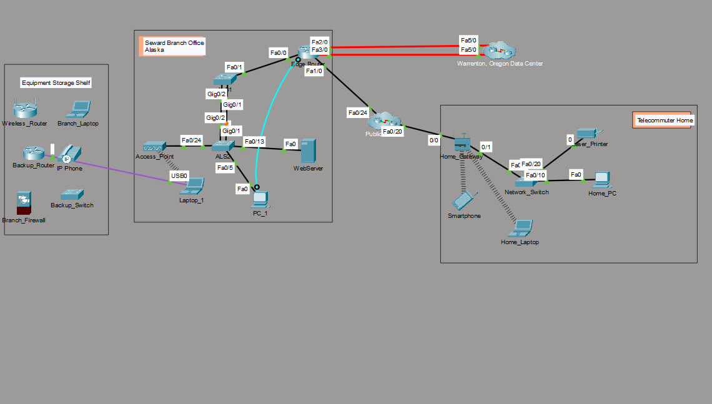
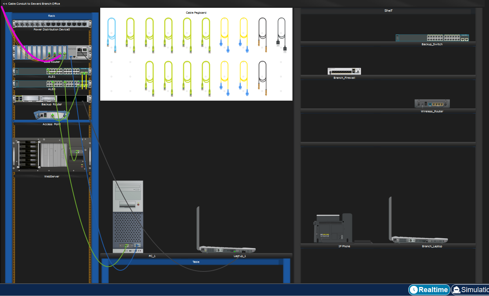
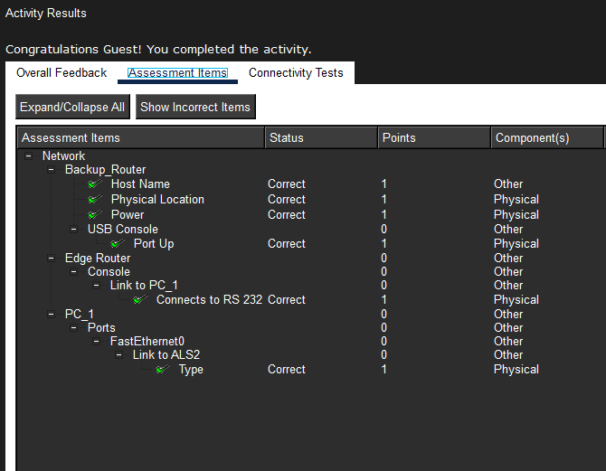

# Module 1: Lab Documentation

##  Activity 1.0.5: Packet Tracer - Logical and Physical Mode Exploration

###  Objective
The goal of this activity was to navigate the Packet Tracer interface and understand the difference between the **Logical** view (conceptual network flow) and the **Physical** view (real-world hardware placement).

###  Observations & Tasks
* **Logical Mode:** I explored the network topology and verified connectivity between devices using the **Ping** command in the command prompt.
* **Physical Mode:** I navigated through the **Corporate Office** to the **Main Wiring Closet** to see how equipment is mounted in racks and how cables (Ethernet/Fiber) are physically connected.

###  Proof of Completion
Below are the screenshots from my activity:

#### 1. Logical Topology

#### 2. Physical Rack & Cabling

#### 3. Completion Verification

---
[⬅️ Back to Module Index](./README.md)
